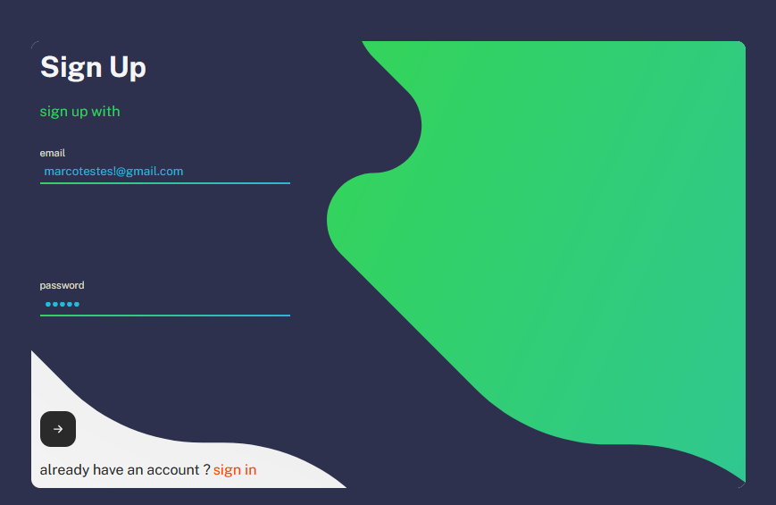
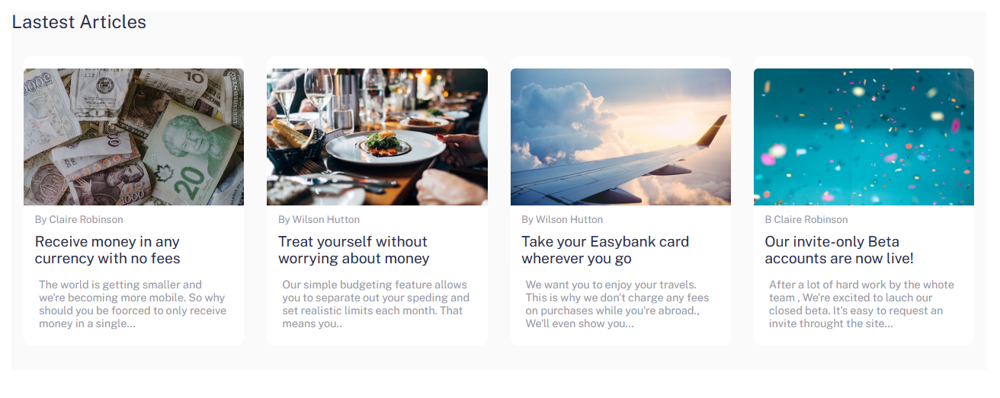

# auth frontend 🔐

repository created to practice user authentication

## technologies used 

✨✨✨✨✨✨✨✨✨✨✨
> react | node | css | html | axios | react-icons
✨✨✨✨✨✨✨✨✨✨✨

test on your machine

* first, install the dependencies
> npm i  
#### or 
> yarn

* added env file
> Create a __.env file__ at the __root__ of the project, right after creating a variable __named according to the image below__, and insert the URL __http://localhost:80__ into the variable

* final step
> finally, in your terminal run the yarn start command

## some demo images of the project

> Entry form for users who already have a registration

> form for creating new users

> desktop version main page header

> main page footer desktop version

> main page desktop version

> desktop cards version

### mobile parts

> mobile version header

> mobile version footer

> mobile version cards

> mobile version menu toggle

> mobile version button

__project in development__ ⏳
 
> 🚨 note: accepting feedback, corrections, improvements, tips and the like, I'm a newbie and nothing better than having feedbacks from more experienced people to become a high-level professional

